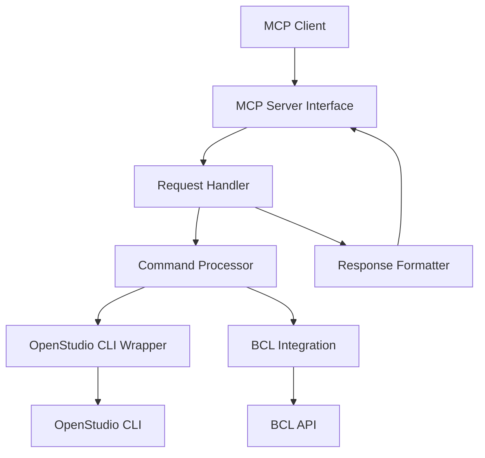

# OpenStudio MCP Server - Developer Guide

This guide provides detailed information for developers who want to understand, modify, or extend the OpenStudio MCP Server.

## Table of Contents

- [Architecture Overview](#architecture-overview)
- [Project Structure](#project-structure)
- [Core Components](#core-components)
- [Adding New Capabilities](#adding-new-capabilities)
- [Testing](#testing)
- [Debugging](#debugging)
- [Best Practices](#best-practices)
- [Contribution Guidelines](#contribution-guidelines)

## Architecture Overview

The OpenStudio MCP Server follows a layered architecture pattern designed to provide a clean separation of concerns and facilitate extensibility.

### Architecture Diagram



### Key Components

1. **MCP Server Interface**: Handles the communication with MCP clients, following the MCP protocol for request and response handling.
2. **Request Handler**: Validates incoming requests and routes them to the appropriate command processor.
3. **Command Processor**: Translates MCP requests into OpenStudio CLI commands and orchestrates their execution.
4. **OpenStudio CLI Wrapper**: Provides a secure interface to execute OpenStudio CLI commands.
5. **BCL Integration**: Manages interaction with the Building Component Library (BCL) for measure discovery, recommendation, and download.
6. **Response Formatter**: Formats the results of OpenStudio CLI commands into user-friendly responses.

### Data Flow

1. The client sends a request to the MCP Server Interface.
2. The MCP Server Interface validates the request and passes it to the Request Handler.
3. The Request Handler routes the request to the appropriate Command Processor.
4. The Command Processor translates the request into OpenStudio CLI commands and executes them using the OpenStudio CLI Wrapper.
5. The OpenStudio CLI Wrapper executes the commands and returns the results.
6. The Command Processor processes the results and passes them to the Response Formatter.
7. The Response Formatter formats the results and returns them to the client.

## Project Structure

The OpenStudio MCP Server is organized into the following directory structure:

```
openstudio-mcp-server/
├── src/                  # Source code
│   ├── config/           # Configuration
│   ├── handlers/         # Request handlers
│   ├── interfaces/       # TypeScript interfaces
│   ├── services/         # Core services
│   ├── utils/            # Utility functions
│   ├── index.ts          # Entry point
│   └── server.ts         # Server implementation
├── test/                 # Tests
│   ├── __mocks__/        # Test mocks
│   ├── integration/      # Integration tests
│   └── unit/             # Unit tests
├── dist/                 # Compiled code
├── docs/                 # Documentation
├── measures/             # Downloaded BCL measures
├── templates/            # Model templates
├── temp/                 # Temporary files
└── package.json          # Package configuration
```

## Core Components

### MCP Server Interface

The MCP Server Interface is implemented in `src/services/mcpServer.ts`. It handles the communication with MCP clients, following the MCP protocol for request and response handling.

Key responsibilities:
- Register capabilities with the MCP client
- Receive and validate MCP requests
- Route requests to the appropriate handler
- Return formatted responses to the MCP client

### Request Handler

The Request Handler is implemented in `src/handlers/requestHandler.ts`. It validates incoming requests and routes them to the appropriate command processor.

Key responsibilities:
- Validate request schema
- Extract request parameters
- Route request to appropriate command processor
- Handle errors and exceptions

### Command Processor

The Command Processor is implemented in `src/services/commandProcessor.ts`. It translates MCP requests into OpenStudio CLI commands and orchestrates their execution.

Key responsibilities:
- Translate MCP requests into OpenStudio CLI commands
- Orchestrate command execution
- Handle command results
- Manage file operations

### OpenStudio CLI Wrapper

The OpenStudio CLI Wrapper is implemented in `src/utils/openStudioCommands.ts`. It provides a secure interface to execute OpenStudio CLI commands.

Key responsibilities:
- Execute OpenStudio CLI commands securely
- Prevent command injection
- Handle command output
- Manage process lifecycle

### BCL Integration

The BCL Integration is implemented in `src/services/bclApiClient.ts`. It manages interaction with the Building Component Library (BCL) for measure discovery, recommendation, and download.

Key responsibilities:
- Query BCL for available measures
- Download and install measures
- Recommend measures based on context
- Update previously downloaded measures
- Handle BCL unavailability

### Response Formatter

The Response Formatter is implemented in `src/services/responseFormatter.ts`. It formats the results of OpenStudio CLI commands into user-friendly responses.

Key responsibilities:
- Format command results
- Handle error messages
- Structure responses according to MCP protocol
- Include relevant metadata

## Adding New Capabilities

To add a new capability to the OpenStudio MCP Server, follow these steps:

### 1. Define the Capability

Add the capability definition to the `initializeCapabilities` method in `src/services/mcpServer.ts`:

```typescript
this.capabilities.push({
  name: 'openstudio.newCapability',
  description: 'Description of the new capability',
  parameters: {
    param1: {
      type: 'string',
      description: 'Description of param1',
      required: true,
    },
    param2: {
      type: 'number',
      description: 'Description of param2',
      required: false,
    },
  },
});
```

### 2. Create a Validation Schema

Add a validation schema for the new capability in `src/utils/validation.ts`:

```typescript
const newCapabilitySchema = {
  type: 'object',
  properties: {
    param1: { type: 'string' },
    param2: { type: 'number' },
  },
  required: ['param1'],
};

export const requestSchemas: Record<string, object> = {
  // Existing schemas...
  'openstudio.newCapability': newCapabilitySchema,
};
```

### 3. Implement the Handler

Add a handler method for the new capability in `src/handlers/requestHandler.ts`:

```typescript
private async handleNewCapability(params: any): Promise<CommandResult> {
  logger.info({ params }, 'New capability request received');
  
  try {
    // Validate required parameters
    if (!params.param1) {
      return {
        success: false,
        output: '',
        error: 'Missing required parameter: param1 is required',
      };
    }
    
    // Implement the capability logic
    // ...
    
    return {
      success: true,
      output: 'New capability executed successfully',
      data: {
        // Result data...
      },
    };
  } catch (error) {
    logger.error({ params, error }, 'Error executing new capability');
    
    return {
      success: false,
      output: '',
      error: error instanceof Error ? error.message : String(error),
    };
  }
}
```

### 4. Register the Handler

Register the handler in the `registerDefaultHandlers` method in `src/handlers/requestHandler.ts`:

```typescript
this.registerHandler(
  'openstudio.newCapability', 
  this.handleNewCapability.bind(this),
  getValidationSchema('openstudio.newCapability') || {},
  'Description of the new capability'
);
```

### 5. Implement the Capability Logic

Implement the logic for the new capability. This may involve:
- Creating new utility functions
- Adding new OpenStudio CLI commands
- Implementing new services
- Adding new file operations

### 6. Add Tests

Add tests for the new capability in the appropriate test files:
- Unit tests in `test/unit/`
- Integration tests in `test/integration/`

### 7. Update Documentation

Update the API documentation in `docs/api.md` to include the new capability.

## Testing

The OpenStudio MCP Server uses Vitest for testing. Tests are organized into unit tests and integration tests.

### Running Tests

To run all tests:

```bash
npm test
```

To run tests with coverage:

```bash
npm run test:coverage
```

To run tests in watch mode:

```bash
npm run test:watch
```

### Writing Tests

#### Unit Tests

Unit tests should test individual components in isolation. Use mocks to isolate the component under test from its dependencies.

Example unit test:

```typescript
import { describe, it, expect, vi } from 'vitest';
import { RequestHandler } from '../../src/handlers/requestHandler';

// Mock dependencies
vi.mock('../../src/utils/logger', () => ({
  logger: {
    info: vi.fn(),
    warn: vi.fn(),
    error: vi.fn(),
  },
}));

describe('RequestHandler', () => {
  it('should handle a valid request', async () => {
    // Arrange
    const requestHandler = new RequestHandler();
    const request = {
      id: 'test-request',
      type: 'openstudio.model.info',
      params: {
        modelPath: '/path/to/model.osm',
      },
    };
    
    // Act
    const response = await requestHandler.handleRequest(request);
    
    // Assert
    expect(response.status).toBe('success');
    expect(response.id).toBe('test-request');
    expect(response.type).toBe('openstudio.model.info');
  });
});
```

#### Integration Tests

Integration tests should test the interaction between components. Use real dependencies when possible, but mock external services like the OpenStudio CLI and BCL API.

Example integration test:

```typescript
import { describe, it, expect, vi } from 'vitest';
import { MCPServer } from '../../src/services/mcpServer';
import WebSocket from 'ws';

// Mock WebSocket
vi.mock('ws', () => ({
  default: vi.fn().mockImplementation(() => ({
    on: vi.fn(),
    send: vi.fn(),
  })),
}));

describe('MCPServer', () => {
  it('should handle a WebSocket connection', () => {
    // Arrange
    const mcpServer = new MCPServer();
    const ws = new WebSocket('ws://localhost:3000');
    
    // Act
    mcpServer.handleConnection(ws);
    
    // Assert
    expect(ws.on).toHaveBeenCalledWith('message', expect.any(Function));
    expect(ws.on).toHaveBeenCalledWith('close', expect.any(Function));
    expect(ws.on).toHaveBeenCalledWith('error', expect.any(Function));
    expect(ws.send).toHaveBeenCalled();
  });
});
```

## Debugging

### Logging

The OpenStudio MCP Server uses Pino for logging. Logs are output to the console by default, but can be redirected to a file or other destination.

Log levels:
- `error`: Error messages
- `warn`: Warning messages
- `info`: Informational messages
- `debug`: Debug messages
- `trace`: Trace messages

To change the log level, set the `LOG_LEVEL` environment variable:

```bash
LOG_LEVEL=debug npm start
```

### Debugging with VS Code

To debug the OpenStudio MCP Server with VS Code, add the following configuration to `.vscode/launch.json`:

```json
{
  "version": "0.2.0",
  "configurations": [
    {
      "type": "node",
      "request": "launch",
      "name": "Launch Program",
      "skipFiles": ["<node_internals>/**"],
      "program": "${workspaceFolder}/src/index.ts",
      "outFiles": ["${workspaceFolder}/dist/**/*.js"],
      "env": {
        "LOG_LEVEL": "debug"
      }
    }
  ]
}
```

## Best Practices

### Code Style

The OpenStudio MCP Server follows the following code style guidelines:

- Use TypeScript for type safety
- Use ESLint and Prettier for code formatting
- Use meaningful variable and function names
- Use comments to explain complex logic
- Use async/await for asynchronous code
- Use try/catch blocks for error handling
- Use logger for logging

### Error Handling

The OpenStudio MCP Server uses a consistent error handling approach:

- Use try/catch blocks to catch exceptions
- Log errors with context
- Return appropriate error responses
- Include error details in the response

Example error handling:

```typescript
try {
  // Code that might throw an exception
} catch (error) {
  logger.error({ params, error }, 'Error message');
  
  return {
    success: false,
    output: '',
    error: error instanceof Error ? error.message : String(error),
  };
}
```

### Security

The OpenStudio MCP Server implements several security measures:

- Command validation to prevent command injection
- Secure file handling to prevent unauthorized access
- Input sanitization to prevent injection attacks
- Error handling to prevent information leakage
- Rate limiting to prevent abuse

When implementing new capabilities, ensure that you follow these security practices.

## Contribution Guidelines

### Code Contributions

To contribute code to the OpenStudio MCP Server:

1. Fork the repository
2. Create a new branch for your feature or bug fix
3. Write tests for your changes
4. Implement your changes
5. Run tests to ensure they pass
6. Submit a pull request

### Pull Request Guidelines

When submitting a pull request:

1. Provide a clear description of the changes
2. Include any relevant issue numbers
3. Ensure all tests pass
4. Follow the code style guidelines
5. Update documentation as needed

### Issue Reporting

When reporting an issue:

1. Provide a clear description of the issue
2. Include steps to reproduce the issue
3. Include any relevant error messages or logs
4. Specify the version of the OpenStudio MCP Server
5. Specify the version of OpenStudio
6. Specify the operating system

### Code Review

All code contributions will be reviewed before being merged. The review process ensures that:

1. The code follows the style guidelines
2. The code is well-tested
3. The code is secure
4. The code is maintainable
5. The code is documented

### Documentation

When contributing documentation:

1. Use clear and concise language
2. Use proper formatting
3. Include examples where appropriate
4. Update the table of contents as needed
5. Check for spelling and grammar errors